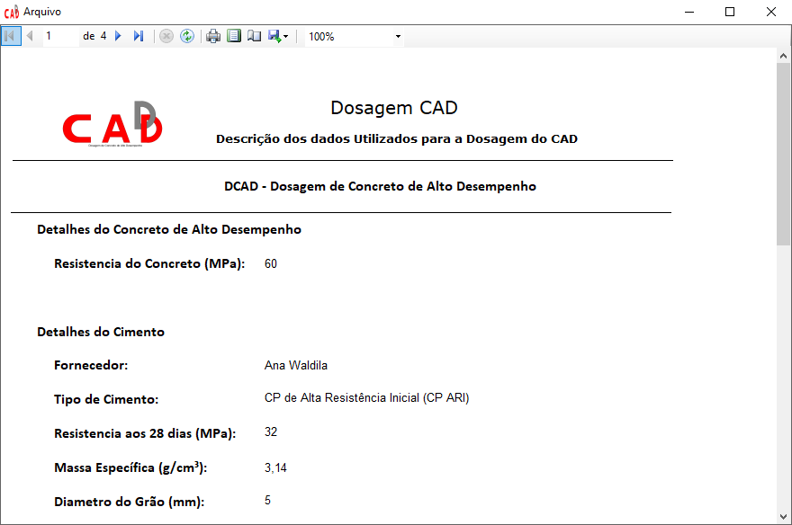
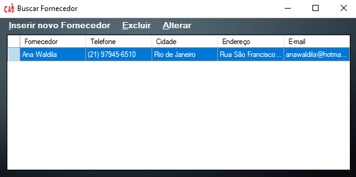
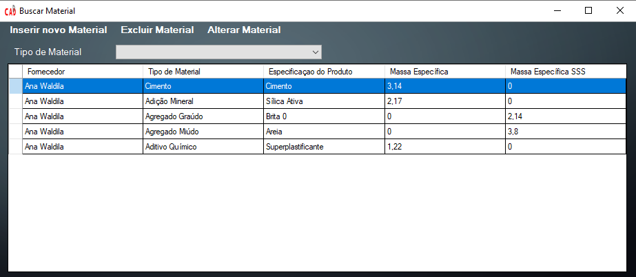
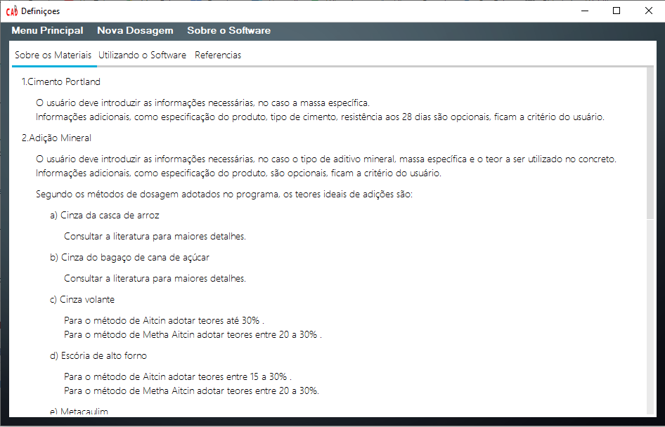
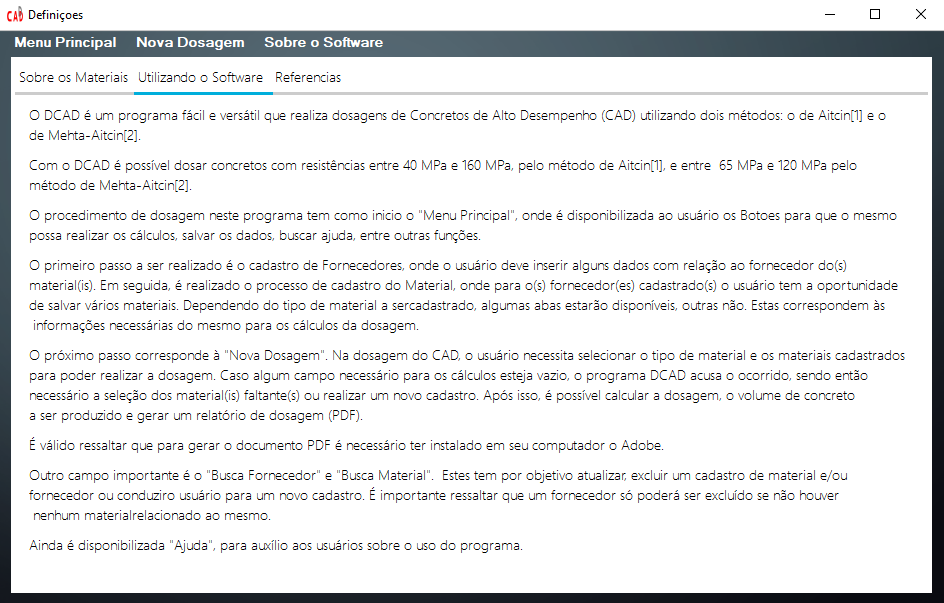
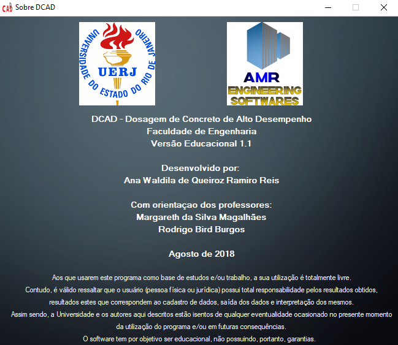

# DCAD Desktop Version 1.0

## Introduction

DCAD is a desktop software developed in the Visual Basic programming language, and Visual Studio 2017 platform was used. "Dosagem de Concreto de Alto Desempenho", in Portuguese, this software presents a dosage for a High Performance Concrete (HPC) based on the characteristics of the materials and the method chosen by the user. DCAD is designed with the ability to save, delete, search a record and change records about materials and their providers. After registering all the necessary database, the user can calculate their own dosage and, finally, it is possible to save it as a PDF file.

## Software DCAD

The software starts with a main window, which it is possible to visualize some operations in its menu. The  first one is "Cadastro" (register) and the user can choose between "Fornecedor" (provider's materials) or "Materiais" (materials). It is important to explanate, in this case, the user needs to registe at the least one provider's materials before to register a material. Second one is "Nova Dosagem" (new dosage), all materials are registered and it is possible to create a new dosage. Third, "Buscar" (search), where the user can choose a material or a provider's material. Fourth, "Ajuda" (help), it is can possible to choose between help to use the software or about the software. Finally, the last one is "Sair" (exit). The software's principal window is shown in Figure 1.

 <b>Figure 1:</b> DCAD - Principal Window

First, register a new provider. Some pieces of information about the provider are necessary: "Fornecedor" (provider's name), "Telefone" (contact number/ telephone), "Cidade" (city), "Endereço" (address) and "E-mail" (e-mail). After complete all those pieces of information, only click in "Salvar Cadastro" (save register). Figure 2 shows all this.

 <b>Figure 2:</b> DCAD - Provider Register Window

Second, in principal menu, user can click on "Cadastro" (register) and, after, "Materiais" (materials) to register a material. First step is to create a relationship between the material and this provider, i.e., all materials must create a relationship with at least one supplier, necessarily. So, the menu "Informações" (information) has a button "Procurar" (search register) and the user can click on the button and find a provider that could creates a relationship with a material. After this, the user needs to choose which material wants to register: "Cimento" (cement), "Adição Mineral" (minearl adition), "Agregado Graúdo" (coarse aggregate), "Agregado Miúno" (send) and "Aditivo Químico" (chemistry adition). For each material, some boxes will open, based on the characteristics of the material. For more details, read Reis et al (2016). Figure 3 shows the materials register.

 <b>Figure 3:</b> DCAD - Materials Register Window

"Nova Dosagem" (new dosagem) is the third and principal step. The software opens a new window that there are some tabs to complete (the tab's name are the same of the materials, exception that "Dados Gerais" - general data - and "Ar Incorporado" - incorporate air). The first tab has 2 textbox and 1 combobox to complete: "Nome da Dosagem" (dosage's name), "Registência do Concreto (MPa)" (concrete resistence in compression) and "Método de Dosagem" (dosage's method) and for this one the user can choose between "Método de Aitcin" (Aitcin's method) and "Método de Mheta Aitcin" (Mheta Aitcin's methods) - about those two methods, read Reis et al (2016). After complete this, click to "Próximo" (next), Figure 4.

 <b>Figure 4:</b> DCAD - Dosage Window Part 1 

The first tab of material is "Cimento" (Cement). Automatically, all cement's material that was registrated appears in a table and only is necessary to click in "Inserir" (insert), and all information about the cement that was choosed by the user are inserted in all textboxs, as shown in Figure 5.

 <b>Figure 5:</b> DCAD - Dosage Window Part 2 

All other materias are the same process. However, in some cases the user needs to input the data, for instance, in "Adição Mineral 1" (mineral adition 1), it is necessary to input the percentage to be used (%), "Teor a Utilizar", because this information is not fixed. Figure 6 shows this.

 <b>Figure 6:</b> DCAD - Dosage Window Part 3 

After this, the software opens a box with a question, if the user can input a second option of minearl adition. If the answer is yes, another tab opens ("Adição Mineral 2 - mineral adition 2), if is not, the tab of "Agregado Miúdo" (sand) opens and "Adição Mineral 2" (mineral adition 2) is not enable.
Both tabs "Agregado Miúdo" (sand) and "Agregado Graúdo" (coarse aggregate) present the same pieces of informations. The user choose a register and, after insert, it needs to inform the water concentration, in %, "Teor de Água", and capacity water's absorvation, in %, "Absorção de Água (%)", as shown in Figure 7.

 <b>Figure 7:</b> DCAD - Dosage Window Part 4 

The last one is "Ar Incorporado" (incorporated air), which one is necessary to know the volume of air in concrete, Figure 8. If the user does not know, suggest to read the literature of Aitcin method and Mheta Aitcin method. 

 <b>Figure 8:</b> DCAD - Dosage Window Part 5 

Finally, press button "Resultado" (result) and a new window is opened, Figure 9. In this window, the first column presents the result of dosage when the sand and stone are saturated with dry surface. The second one, the user needs to insert the volume of concrete that wants, in "Volume de Concreto (m³)" (concrete volume, m³). After insert this information, only click in button "Calcular" (calculate) and the second column is completed.

 <b>Figure 9:</b> DCAD - Result Window

In menu, the user can click in "Gerar Aarquivo" (create a file) and creates a new PDF file, as shown in Figure 10.

 <b>Figure 10:</b> DCAD - PDF Window

The user has the option to search for a register in the program, in the main menu, option “Buscar” (Search). Then the user can choose a provider or a material. If the option is to search for a provider, a new window opens, Figure 11, and the user has some options: "Inserir novo Fornecedor" (register new provider), "Excluir" (delete a provider, in this case, the provider that is selected in blue) and "Alterar" (change a provider, in this case the provider selected in blue). "Inserir novo Fornecedor" and "Change" open the same window shown in Figure 2. "Delete" opens a conversation window showing a question if the user should certainly delete the provider. Deleting a provider automatically deletes all related materials.

 <b>Figure 11:</b> DCAD - Find Provider Window

The same way is for searching materials. A new window opens with all materials registered, Figure 12. "Inserir novo Material" (register new material) and "Alterar Material" (change material) open the window presented in Figure 3. Only in case "Excluir" (delete) delete the material selected in blue.

 <b>Figure 12:</b> DCAD - Find Materials Window

Finally, the last button in main window is "Ajuda" (Help), which one the user can choose between "Sobre os Materiais" (about the materials), "Utilizando o Software" (using the software) and "Sobre o Software" (about the software). A new window opens with all those options. Figures 13 to 15 show this.

 <b>Figure 13:</b> DCAD - About Material Window

 <b>Figure 14:</b> DCAD - Using Software Window

 <b>Figure 15:</b> DCAD - About Software Window

DCAD software has a Brazilian Registration in INPI (Instituto Nacional de Propriedade Industrial) and the registration number is BR 51 2016 000973-0.

## References

REIS, A. W. Q. R.; MAGALHAES, M. S. ; BURGOS, R. B. . Dosagem de Concretos de Alto Desempenho Utilizando a Ferramenta Computacional DCAD. SODEBRÁS, v. 135, p. 176-181, 2017.

REIS, A. W. Q. R.; MAGALHAES, M. S. ; BURGOS, R. B. . Desenvolvimento de um Software para Dosagem de CAD. REVISTA INTERDISCIPLINAR DE PESQUISA EM ENGENHARIA, v. 2, p. 251-268, 2016.

REIS, A. W. Q. R.; MAGALHAES, M. S. ; BURGOS, R. B. . DCAD - Aplicativo para Celular Android como Ferramenta para Dosagem de Concreto de Alto Desempenho. In: 59º Congresso Brasileiro do Concreto - CBC 2017, 2017, Bento Gonçalves - RS. Anais do 59º Congresso Brasileiro do Concreto - CBC 2017, 2017.

REIS, A. W. Q. R.; MAGALHAES, M. S. ; OHNUMA JUNIOR, A. A. . Dosagem de Concretos de Alto Desempenho Utilizando a Ferramenta Computacional DCAD. In: XXXVI INTERNATIONAL SODEBRAS CONGRESS, 2016, Belo Horizonte. XXXVI INTERNATIONAL SODEBRAS CONGRESS, 2016.

REIS, A. W. Q. R.; MAGALHAES, M. S. ; BURGOS, R. B. . Desenvolvimento de um Software para Dosagem de CAD. In: CILAMCE 2016 - XXXVII Ibero-Latin American Congress on Computational Methods in Engineering, 2016, Brasília. CILAMCE 2016 - Proceedings, 2016. v. 1. p. 1.

## Information About the Software

Rio de Janeiro State University

Faculty of Engineering

Developer: Ana Waldila de Queiroz Ramiro Reis

Professors: Margareth da Silva Magalhães and Rodrigo Bird Burgos

Contact: anawaldila@hotmail.com
