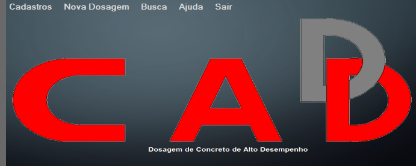
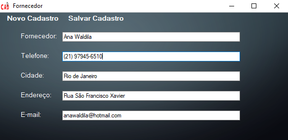
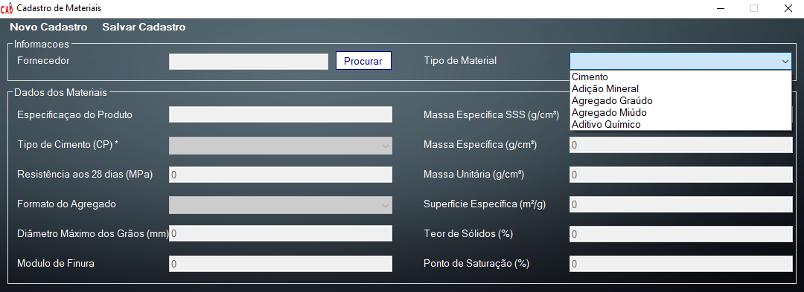
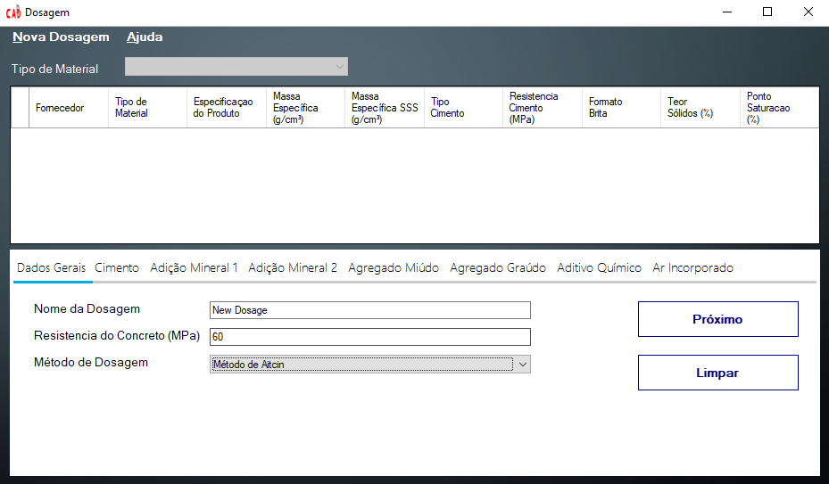
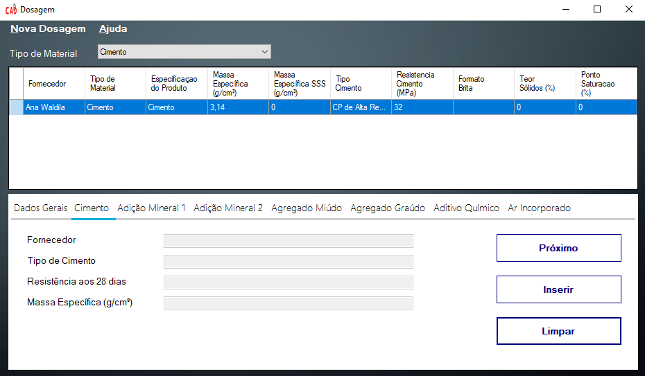
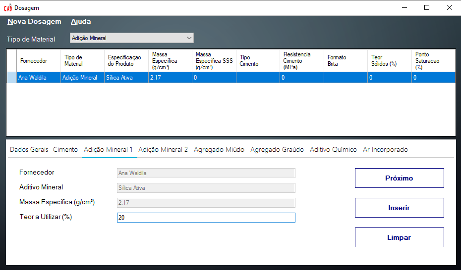
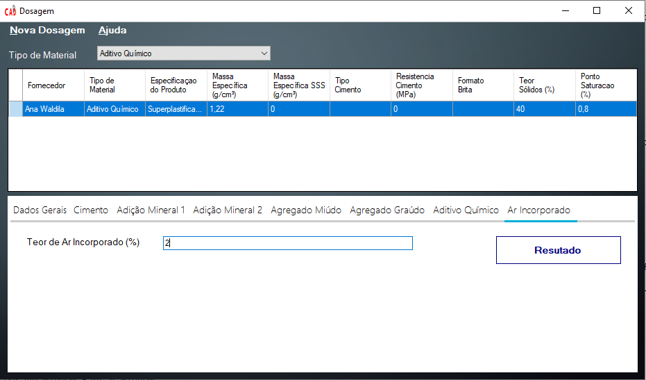
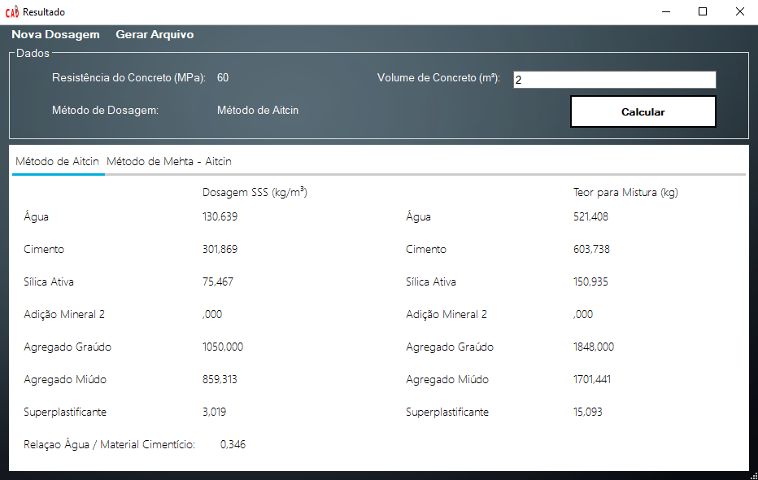

# DCAD Desktop Version 1.0

## Introduction

DCAD is a desktop software developed in Visual Basic computational language, when it was used Visual Studio 2017 platfom. "Dosagem de Concreto de Alto Desempenho", the name in Portuguese, this software presents a dosage for a High Performance Concrete (HPC) based on the characteriscs of the materials and the method choose for the user. DCAD has developed with capacity to save, delete, search a register and change register about materials and provider's materials. After register all data base necessaire, the user can be calculate its own dosage and, finally, it is possible to save in PDF file.

## Software DCAD

The software starts with a principal window, where it is possible to see some operations in their menu. The  first one is "Cadastro" (register) and the user can choose between "Fornecedor" (provider's materials) or "Materiais" (materials). It is important to explanate, in this case, if the user not registered any materials, it is necessaire to registe at the least one provider's materials. Second one is "Nova Dosagem" (new dosage), when all materials necessaires to realize a new dosage are registered. Third, "Buscar" (choose), where the user can choose a material or a provider's material. Fourth, "Ajuda" (help), is can possible to choose between help to use the software or about the software. Finally, the last one is "Sair" (exit). The software's principal window can be see in Figure 1.

 <b>Figure 1:</b> DCAD - Principal Window

First, it is importante to register a new provider. About this, some informations about the provider are necessaires: "Fornecedor" (name), "Telefone" (contact number/ telephone), "Cidade" (city), "Endereço" (address) and "E-mail" (e-mail). After complete all those informations, only click in "Salvar Cadastro" (save register). Figure 2 shows all this.

 <b>Figure 2:</b> DCAD - Provider Register Window

Second, in principal menu, user click on "Cadastro" (register) and, after, "Materiais" (materials) to register some materials. It is really important to know about the register of materials. First step is to find the provider that to relationaze a material to register, i.e., all materials needs to create a relation with at leaste one provider, necessarilly. So, in rectangle "Informações" (informations) has a button "Procurar" (search register), user clicks on the button and can find a provider's material that can relationate with a material. After this, the user needs to choose which material wants to register: "Cimento" (cement), "Adição Mineral" (minearl adition), "Agregado Graúdo" (stone), "Agregado Miúno" (send) and "Aditivo Químico" (chemistry adition). For each material, some text boxes will open, respectivelly for material's characteristics. For more explanations, read Reis et al (2016). Figure 3 shows the materials register.

 <b>Figure 3:</b> DCAD - Materials Register Window

"Nova Dosagem" (new dosagem) is the third and principal steep. The software open a new window that there is some tabs to complete (the tab's name are the same of the materials, exception that "Dados Gerais", general data, and "Ar Incorporado", incorporate air). The first tab has 2 textbox and 1 combobox to complete: "Nome da Dosagem" (dosage's name), "Registência do Concreto (MPa)" (concrete resistence in compression) and "Método de Dosagem" (dosage's method), where can choose between "Método de Aitcin" (Aitcin's method) and "Método de Mheta Aitcin" (Mheta Aitcin's methods) - about those two methods, read Reis et al (2016). After complete this, click to "Próximo" (next), Figure 4.

 <b>Figure 4:</b> DCAD - Dosage Window Part 1 

After this, the first tab of material is "Cimento" (Cement). Automatically, all cement's material that was registrated appears in a table and only is necessaire to click in "Inserir" (insert), and all informations about the cement that was choosed are inserted in all textboxs, like in Figure 5.

 <b>Figure 5:</b> DCAD - Dosage Window Part 2 

All other materias are the same process, but in some cases the user needs to input same data. For instance, in "Adição Mineral 1" (mineral adition 1), it is necessaire to input content to be used (%), "Teor a Utilizar", because this information is not fixed. Figure 6 shows this:

 <b>Figure 6:</b> DCAD - Dosage Window Part 3 

After this, the software opens a box with a question, if the user can input a second option of minearl adition. If yes, another tab opens, if not, the tab of "Agregado Miúdo" (sand) opens.
Both tabs "Agregado Miúdo" (sand) and "Agregado Graúdo" (stone) are the same informations. The user choose a register and, after insert, it needs to inform the water concentration, in %, "Teor de Água", and capacity water's absorvation, in %, "Absorção de Água (%)", like Figure 7.

 <b>Figure 7:</b> DCAD - Dosage Window Part 4 

The last one is "Ar Incorporado" (incorporated air), where it is necessaire to know the volume of air is in concrete, Figure 8. If the user does not know, suggest to see the literature of Aitcin method and Mheta Aitcin method. 

 <b>Figure 8:</b> DCAD - Dosage Window Part 5 

Finally, press button "Resultado" (result) and a new window is opened, Figure 9. In this window, the first column presents the result of dosage when the sand and stone are saturated with dry surface. The second one, the user needs to insert the volume of concrete that wants, in "Volume de Concreto (m³)" (concrete volume, m³). After insert this information, only click in button "Calcular" (calculate) and the second column is completed.

 <b>Figure 8:</b> DCAD - Result Window

